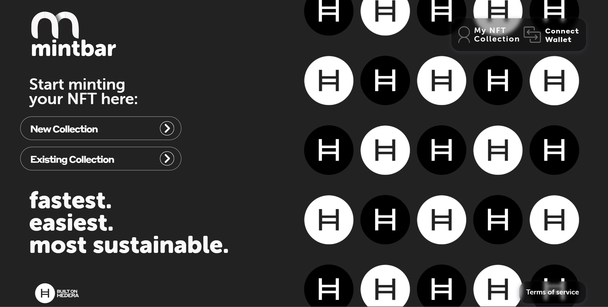

# Hedera NFT Minter App

An example web app that demonstrates how you can mint NFTs on the Hedera network using [HashPack ](https://hips.hedera.com/hip/hip-412) or [Blade](https://hips.hedera.com/hip/hip-412) wallet and upload metadata with an image to IPFS provider supporting [HIP-412 standard](https://hips.hedera.com/hip/hip-412). App also included simply ``My NFT Gallery`` page, where connected user NFTs are listed.



#### Built With

- [Hedera Hashgraph](https://www.hedera.com/) - The enterprise-grade public network
- [Hedera Mirror Node](https://docs.hedera.com/guides/core-concepts/mirror-nodes/) - provides a way to store and cost-effectively query historical data from the public ledger
- [Hedera Hashgraph JavaScript SDK](https://github.com/hashgraph/hedera-sdk-js) - The easiest way to use Hedera in JavaScript
- [NFT Storage](https://api.nft.storage) - The long-term storage service designed for off-chain NFT data
- [Node.JS](https://nodejs.org) - Node.js is an open-source, cross-platform, back-end JavaScript runtime environment
- [React.JS](https://reactjs.org/) - A fast, unopinionated web framework for node.js
- [TypeScript](https://www.typescriptlang.org/) - Strongly typed programming language that builds on JavaScript
- [SASS](https://sass-lang.com/) - The most mature, stable, and powerful professional-grade CSS extension language in the world.
- [BabelJS](https://babeljs.io/) - A real-time client-to-server framework for node.js
- [WebPack](https://webpack.js.org/) - Static module bundler for modern JavaScript applications

## Created by
 - Norbert Kulus
 - Patryk Matyjasiak

## Prerequisites

This demo assumes that you are familiar with [Node.JS](https://nodejs.org) based applications and using [React.JS](https://reactjs.org/) UI framework.
Also, you need to be familiar with using [Hedera Mirror Node](https://docs.hedera.com/guides/core-concepts/mirror-nodes/), [Hedera Hashgraph JavaScript SDK](https://github.com/hashgraph/hedera-sdk-js).
You will need to generate API key(s) from [NFT Storage](https://api.nft.storage) to store NFTs images and metadata or configure your own IPFS provider (or implement your own IPFS service usage).
To use an app, you will also need a Hedera Account connected within [HashPack ](https://hips.hedera.com/hip/hip-412) or [Blade](https://hips.hedera.com/hip/hip-412) wallet. If you don't have one yet, sign up at [portal.hedera.com](https://portal.hedera.com/).


## Getting Started

You can clone this repository by running the following command:

```
git clone https://github.com/hashgraph/hedera-nft-minter
```

Copy the `.env.sample` file and rename the copy to `.env`

Then update the newly renamed `.env` file with your IPFS URL, Hedera network type, Mirror Node version, and HashPack wallet metadata:

```
APP_NAME=Mintbar

HEDERA_NETWORK=testnet
HEDERA_MIRROR_NODE_API_VERSION=v1

IPFS_URL=https://api.nft.storage
IPFS_KEYS=['key1','key2','key3','key4','key5']
# IPFS_GATEWAYS=['https://gateway.1/{CID}','https://{CID}.gateway.2']

HASHPACK_APP_CONFIG_NAME=Mintbar.xyz
HASHPACK_APP_CONFIG_DESCRIPTION=Mint your own NFT.
# HASHPACK_APP_CONFIG_ICON_URL=

```
- The `APP_NAME` is used for generating localStorage variable names for holding both wallets' connection data.
- The `HEDERA_NETWORK` holds Hedera Network type (testnet, mainnet)
- The `HEDERA_MIRROR_NODE_API_VERSION` is a variable for storing the mirror node API version
- The `IPFS_URL` is your IPFS storage API URL (currently only the [https://api.nft.storage](https://api.nft.storage) is implemented)
- The `IPFS_KEYS` is an array with API keys generated from [NFT Storage](https://api.nft.storage)
- The `IPFS_GATEWAYS` is an array with gateways for fetch IPFS data. ``{cid}`` in url is replaced by true metadata CID of NFT.
- The `HASHPACK_APP_CONFIG_NAME` stores name shown in the HashPack connection modal
- The `HASHPACK_APP_CONFIG_DESCRIPTION` stores description shown in the HashPack connection modal
- The `HASHPACK_APP_CONFIG_ICON_URL` is optional. Stores URL to image shown in HashPack connection modal. If not provided, the app is looking for `${ window.location.protocol }//${ window.location.host }/logo.svg` to serve in the HashPack connection modal 

After downloading and setting up our environment, we'll install our packages via [npm](https://docs.npmjs.com/about-npm/).

```
npm install
```

If installing the dependencies was successful, now try to run the app

```
npm run start
```

## Application design

#### Page Components (*src/pages*)

1. **HomePage** Component : This component includes whole *MinterWizard* used to process minting. The ``handleFormSubmit`` method contains all procedures used for minting an NFT.

2. **MyNFTCollection** Component: This Component displays the listed NFTs of the connected user. This Component gets its data from a JSON file in the assets folder as well. This Component is the Child Component of the *Customers* Component

#### Services (*src/services*)
##### HTS
1. ``createToken({
    accountId: string;
    tokenName: string;
    tokenSymbol: string;
    amount: number;
    customFees?: Fees[];
    keys?: TokenKey[]
})``: method used for generating [TokenCreateTransaction](https://hedera.com). The public key for a connected account is fetched from MirrorNode. 
2. ``mintToken(tokenId: string | TokenId, acc1: string, cids: string[])``: method used for generating [TokenMintTransaction](https://hedera.com)

##### MirrorNode
1. ``async fetchAccountInfo(accountId: string)``: fetch account info for Hedera account. [Mirror Node API - Accounts](https://docs.hedera.com/guides/docs/mirror-node-api/rest-api#api-v1-accounts-idoraliasorevmaddress)
2. ``async fetchTokenInfo(tokenId: string)``: fetch Hedera token info. [Mirror Node API - Token info](https://docs.hedera.com/guides/docs/mirror-node-api/rest-api#token-info)
3. ``async fetchNFTMetadata(cid: string)``: method fetches nft metadata from cid. If CID does not contain HTTPS protocol we use https://ipfs.io/ipfs/ to serve metadata
4. ``async fetchAllNFTs(idOrAliasOrEvmAddress: string)``: in this method, all NFTs connected with the Hedera account are returned. [Mirror Node API - Account NFTs](https://docs.hedera.com/guides/docs/mirror-node-api/rest-api#nfts-by-account-id)
5. ``async fetchCollectionInfoForGroupedNFTs(groupedNfts: GroupedNFTs)``: group NFTs fetched from ``MirrorNode.fetchAllNFTs()`` by collection ID and fetch additional collection info

##### IPFS
Both methods are using random IPFS key from ``.env`` variable for each request.

1. ``uploadFile(file: File | Blob)``: upload file
2. ``createMetadataFile(meta: NFTMetadata)``: upload `metadata.json` file


#### Connection Hooks (*src/utils/hooks*)
##### useHashPack
Inside this hook, the HashConnect instance is created and a connection with the HashPack extension is trying to be established. The hook helps handle connection flow. Inside a hook are listeners for HashPack wallet pairing, extension events and iFrame pairing events. Returns saved connection data, clearing connection method, connection method and HashConnect instance.
```js
const {
    hashConnect,
    hashConnectState,
    connectToHashPack,
    disconnectFromHashPack,
} = useHashPack();
  ```
##### useBladeWallet
Hook provides the ability to connect within the Hedera network with BladeWallet. It helps to handle connection. The hook has reconnect feature similar to the ``useHashPack`` hook. Hook returns connection method, connected user ID, bladeSigner instance and clear pairing method.
```js
const {
    bladeSigner,
    bladeAccountId,
    connectBladeWallet,
    clearConnectedBladeWalletData,
} = useBladeWallet();
  ```

##### useHederaWallets
The connection and sending transaction magic happened here. Hooks under the hood create a context, where the two above hooks are used to provide a connection with each wallet extension. Within ``useHederaWallets`` you can send transactions generated from [Hedera JS SDK](https://hedera.com) signed by an account connected with any supported Hedera wallet extension.
```js
const {
    userWalletId,
    connectedWalletType,
    connect,
    disconnect,
    sendTransaction,
} = useHederaWallets()
```
#### URL (*src/routes/base.tsx*)
The application has:
- ``/`` which ties to **HomePage** Component
- ``/my-nft-collection`` which ties to **MyNFTCollection** Component

#### HTTP calls

**axios** library is used to make HTTP Calls. https://axios-http.com/

#### Hedera calls
- **@hashgraph/sdk**: to generate Hedera transactions. https://github.com/hashgraph/hedera-sdk-js
- **@bladelabs/blade-web3.js**: for submitting transactions with Blade wallet. https://github.com/Blade-Labs/blade-web3.js
- **hashconnect**: for submitting transactions with HashPack wallet. https://www.hashpack.app/hashconnect

## UI Resources
- **ReactJS** : Refer to https://reactjs.org/ to understand the concepts of ReactJS
- **classnames**: https://github.com/JedWatson/classnames#readme
- **lodash**: https://lodash.com/
- **formik**: Reactive forms with https://formik.org/
- **yup**: Easy form validation https://github.com/jquense/yup
- **react-transition-group** : https://reactcommunity.org/react-transition-group/
- **react-toastify**: https://github.com/fkhadra/react-toastify#readme
- **react-scrollbars-custom**: https://github.com/xobotyi/react-scrollbars-custom
- **react-dropzone**: https://react-dropzone.js.org/
- **body-scroll-lock**: https://github.com/willmcpo/body-scroll-lock#readme


## Disclaimer

This is just a simple demo application. Please use responsibly.

[File an issue](/issues) if you see problems.

## Contributing

Contributions are welcome. Please see the
[contributing guide](https://github.com/hashgraph/.github/blob/main/CONTRIBUTING.md)
to see how you can get involved.

## Code of Conduct

This project is governed by the
[Contributor Covenant Code of Conduct](https://github.com/hashgraph/.github/blob/main/CODE_OF_CONDUCT.md). By
participating, you are expected to uphold this code of conduct. Please report unacceptable behavior
to [oss@hedera.com](mailto:oss@hedera.com).

## LICENSE

[Apache 2.0](LICENSE)
